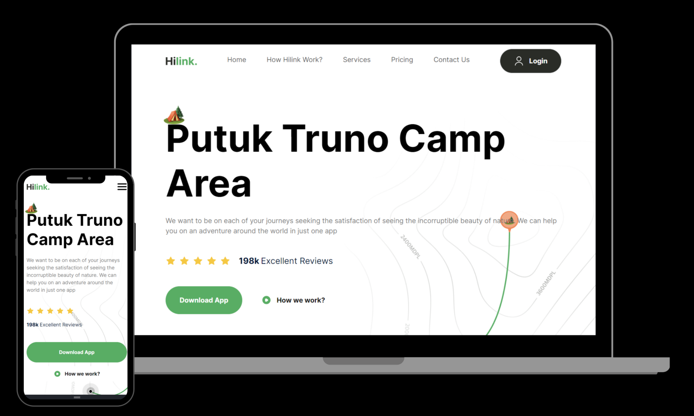

 

 

  

    
    
    
  

  <h3 align="center">Travel Website</h3>

## 🤖 Introduction

Built with Next.js, TailwindCSS, and TypeScript, this landing page not only looks great but also serves as a hands-on project to reinforce one's understanding of these technologies.

## 🚨 Tutorial

This repository contains the code corresponding to an in-depth tutorial available on this YouTube channel, <a href="https://www.youtube.com/@javascriptmastery/videos" target="_blank"><b>JavaScript Mastery</b></a>.

Thanks to the JavaScript Mastery's Tutorials, I could create this application.

## ⚙️ Tech Stack

- Next.js
- Tailwind CSS

## 🔋 Features

👉 **Appealing Hero Section**: Visually striking hero section that captures attention and sets the tone for the website

👉 **Camp Exploration Section**: Showcase various camps in a dedicated section, allowing users to explore different options.

👉 **Engaging Travel Guide Section**: A compelling travel guide section with informative content and captivating visuals.

👉 **Feature-Rich Section**: A complex and feature-rich section offering advanced functionalities or in-depth information.

👉 **Call to Action for Mobile Apps**: A call-to-action section encouraging users to explore the mobile app version, complete with download links.

👉 **Footer**: Comprehensive footer section containing site and social media links for easy navigation and connectivity.

and many more, including code architecture and reusability
